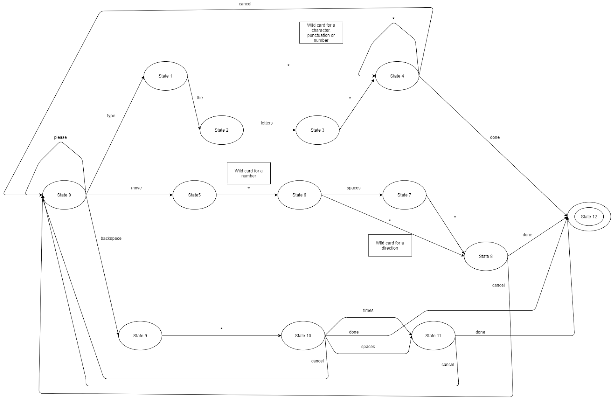

# V2C Desktop Controller for Linux

*Copyright (c) 2020 V2C Development Team. All rights reserved.*

## Build

You need Java 11. This project can be tested and compiled with the following command.
    
`chmod u+x ./gradlew`

`./gradlew clean shadowJar`

## Execution

To run it, just do `java -jar build\libs\v2c-desktop-controller-linux.jar`.

You can optionally specify some command-line arguments.

|Short Param|Long Param|Description        |Default|
|:----------|:---------|:------------------|:---------|
|-p         |--port    |The port number    |5698      |
|-u         |--u       |Enables UI         |Disabled  |

## License

**This repository is subject to the [Apache License, Version 2.0](http://www.apache.org/licenses/LICENSE-2.0).**

## Command Mode

  > target desktop

  > alteration command

## Typing Mode
  > target desktop (you only need to target once)

  > alteration typing
  - Some example commands would be as follows
     - "**type**"
       - “**please type** Juliet Oscar November **done**”
       - "**type** newline **done**"
       - "**type** alpha bravo Charlie **cancel type** Charlie bravo alpha **done**"
       - "**please type** the letters delta Oscar November echo **done**"
       - "**please type** shift one (to type an exclamation) shift J (to type a capital J) **done**"
         - If you say type shift too quickly it will send typeshift, and not recognize the token. You will still be in the initial state in the DFA, so all is good once you say it right.
     - move cursor
       - move 3 up done //current build can only handle number literals, if you have “three” instead of “3”, it will not crash, but will return an error message in the desktop log
       - please move 2 right cancel move 1 right done
       - please move 4 spaces left
     - backspace
       - please backspace 3 spaces done//same issue in current build, must get number literals for recognizer. Plans to handle strings like “three” in works for Robot/hyperviser(ENUM)
       - backspace 3 cancel backspace 4 done
       - backspace 3 times done
       - backspace 2 spaces cancel backspace 1 done

### Typing Mode Schema

## Stream Mode
  > target desktop

  > alteration typing

  - alteration streaming - enter streaming mode
  - Behavior: same as typing mode, except if your word is not a keypress it will type that word
  - alteration select - begin cursor selection at selected location
  - alteration copy - copy currently selected text
  - alteration paste - paste from clipboard
  - move- use to move in selected text.